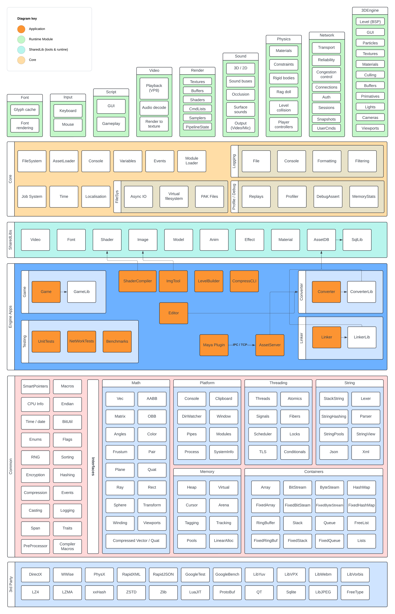

## Synopsis

This project is 3D Game engine that I developed in my spare time over about 6 years.

It served as a technical playground for me to experiment and solve interesting technical problems.

The engine is designed for 3D high detail enclosed levels, which I picked because the tech problems in that area interested me.  
I did not intend to develop or ship such a game as I'm no artist and don't have the budget for such a game.

As such anything visual in the engine is either programmer art or assets found online.

## Architecture



There is a central runtime that handles startup, loads required engine modules and hosts central services like: logging, job system, console, configuration and the virtual file system.

The central runtime is called `core` and can be found under [Pulp](Pulp)
Any application that uses this runtime is referred to as an **EngineApp**.  

The Game, Editor, Converter, Linker, ... are all EngineApps as this allows tools to make use of useful engine features and share code with ease. Each app passes `CoreInitParams` on startup which defines what systems should be enabled so things like loading the render module is skipped for engine tools.

### No blocking IO

One of the design goals of the engine was to have zero blocking IO at runtime this includes opening file handles.

So all IO requests (open, read, write, close) go via the IO thread which handles the async reading.
This means Games can run on top of slow storage or even network backed storage without effecting the frame rate.

The filesystem includes some settings for simulating slow IO with artificial delays to help test this.

### Multithreaded

Another core design goal was multithreaded from the ground up, as many game engines add multithreading at a later date resulting in poor distribution of work and typically one CPU core doing 90% of the work.

To facilitate this the engine has a high throughput job system and core systems are designed with this in mind.

Initially the engine made use of fibres which act like green threads. But I eventually decided the potential for high amounts of cache misses in such a system was not worth it and moved to job system where we have fine grained control on which threads jobs run.

In hindsight I'm not sure heavily leaning in to multithreading was worth it, as it increases the barrier to entry for contributing to the engine.

### No Global allocator

Making a general purpose allocator that works well for all use cases is difficult and requires compromises.

When writing a section of code, if it's obvious what type of allocation strategy would work best I want to be able to make that choice.

So the engine provides a collection of allocation strategies and synchronisation policies that can be used to build an allocation arena.
Combined with a custom c++ [standard library](Pulp/Common) that requires an arena for allocation it makes it trivial to pick the correct allocator for the job.

For developer builds every allocator has a parent and a top level allocator is created for each engine module.  
This gives us a tree of all allocators in the engine that can be traversed for stats collection.

Giving a very fine grained overview of memory usage as a whole, for each module and each section of a given module.

The only exception to this is strings which use a global allocator specialized for strings.

### Stack is king

Throughout the codebase there is a strong focus on using the stack as much as possible when it makes sense.
This helps keep allocations fast and keep working data in the CPUs cache.

The engines [standard library](Pulp/Common) provides stack based versions of most containers to make allocation on the stack trivial.

### Fast builds

Large c++ codebases are typically plagued with slow build times which is something I wanted to avoid.

To combat this the engine is split into various modules that don't depend on each other allowing them to build in parallel.
This also means that even though a full rebuild takes about 60 seconds if you are working on a single module build times are typically below 1 second.

One downside of this approach is that all intermodule communication happens via virtual functions, so the interfaces are designed to accept large batches of data to minimize virtual calls.

For shipping builds all the engine modules are static linked into a single binary which allows devirtualization to occur.

But one very nice upside is that some modules can be compiled with optimisations enabled (Eg physics) allowing the game to run at 60fps without issue with everything else compiled as debug.

### Fast start times

Fast build times are not that useful in supporting quick iteration if the engine then takes forever to load.

To help combat this many of the engine modules are initialized in parallel keeping start times under a second for debug builds and at around 100ms for shipping builds.

## Feature Overview

<details>
<summary>3DEngine</summary>
  

The 3DEngine performs all the logic around rendering creating a long list of commands that is dispatched to the render backend to process.  
Allowing the render backend to be simple minimizing duplicate logic across backends.  
    
- Culling
    - Frustum
    - Recursive Portals
- Rendering
    - Render scale (up or down)
- PrimitiveContext
    - Allows efficient rendering of large amounts of primitives (lines,sphere,cone,rectangles)
    - Used by font engine and GUI
- Materials
    - All drawing in the engine is done with materials (even simple lines)
    - Materials are fully data driven
    - Typical material properties
        - SurfaceType
        - Collision
        - Samplers
        - Textures
        - Texture Tiling
        - Texture Atlas
        - Values passed to Shaders
    - Support for dynamic textures (Eg from a video output)
- Shaders
    - Support for includes and preprocessor directives
    - Automatic input layout detection
    - Permutation system to use the same shader source for multiple vertex types or configurations
        - For example building a shader that has optional support for skinned meshes or lighting
    - Types: Vertex, Pixel, Geo, Hull, Domain
    - Caching with dependency tree
    - Runtime automatically calculates shader inputs (world matrix, model matrix, bone matrix, time, etc..)
        and will manage creating, updating and binding buffers on the GPU
- GUI
    - System for building in game menus using Lua
- Levels
    - Manages the state of the loaded level
    - BSP
    - Models
    - Triggers
    - Entities
    
</details>

<details>
<summary>Rendering</summary>

- Render backends
    - Null (used for servers)
    - Dx12
        - PSO cache
        - Automatic RootSignature builder
        - GPU buffer manager
- 8 render targets
- 8 bound textures
- 12 bound samplers

</details>

<details>
<summary>Fonts</summary>

- Render Engines
    - Custom + FreeType
        - Kerning
        - Signed distance field
        - Shadows
        - Outlines
        - LRU Glyph cache CPU + GPU
    - Null (used for servers)
- Monospaced and proportional fonts
- Supported source formats
    - TrueType
</details>


<details>
<summary>Effects</summary>

- Data derived effect system that allows building complex special effects
- EmmiterTypes
    - BillboardSprite  
    - OrientedSprite  
    - RotatedSprite  
    - Tail  
    - Line  
    - Sound  
    - Model  
    - PlayFX (aka embed another effect at given offset / rotation)  
- Define curves for transformation of
    - Position
    - Rotation
    - Color
    - Alpha
    - Size
    - Velocity
- Stage specific options
    - Looping
    - Count
    - Delay
    - Life

</details>

<details>
<summary>Physics</summary>

- Backends
    - Physx
    - Null
- Support for variable and fixed stepping    
- Multithreaded (jobs are run in the engines global job system)
- Player controllers
- Material types
- Rigid bodies
- Constraints

</details>

<details>
<summary>Sounds</summary>

- Sound engines 
    - WWise
    - Null (used for servers)
- Spatial
- Occlusion
- Dynamic sources (Video audio)
- Multiple buses
    - Main
    - SFX
    - Music
    - Voice

</details>

<details>
<summary>Video</summary>

- Playback
    - Custom VP8 decoder with predictable memory usage / less allocations
    - Video and audio is pre fetched into a ring buffer to minimise stalls from IO delays
- Supported source formats
    - MKV (Vp8, Vorbis)

</details>

<details>
<summary>Networking</summary>

- Client / server network model
- Custom protocol over UDP
    - Reliable / unreliable channels
    - Ordered / unordered channels
    - MTU probing
- Authoritative server
- Snapshot style replication
- Server can rewind for hit detection
- Client-side prediction
- Supports parallel updates (one job per connected client)
- Artificial delay and packet loss simulation
- Huffman trees for efficient text compression (as both client and server have the tree)
- Session system
    - Lobby
    - Chat
    - Makes sure all players are loaded before starting
    - Treat N users as a party (join together)

</details>

<details>
<summary>Scripting</summary>

- Scripting interface exposed via Lua scripts
- LuaJIT (disabled now)

</details>

<details>
<summary>Input</summary>

- Raw input for keyboard and mouse
- Can be polled faster than frame rate

</details>

<details>
<summary>Core</summary>

- Runtime of the engine
- Handles loading modules and plugins
- Logging system host
- Central Assert handler
- Console 
    - Variable system
        - Every module in the engine can register variables that can then be edited in the console
        - Variables can be changed via config files and saved back to disk if changed
    - execute commands (like load levels)
- Event system
    - Used for broadcasting system messages used by various modules
- Profiler
    - Gives high level real time overview of where time was spend for each thread each frame
    - Keeps a ring buffer of N frames history
- Job system
    - Core of multithreading in the engine
- Time System
    - Provides accurate timer for use each frame
    - Multiple timers: Game, UI
    - Time can be scaled via settings
- Replay system
    - Can record user inputs and actions for playback to create automated test runs
        - Eg: load level walk around, switch weapon, fire, ...
- FileSystem
    - Directory watcher for hot reloading
    - IO queue
    - Artificial delay settings for simulating high latency storage
    - Support for long paths
    - Virtual file system
        - Mount files/packs from multiple locations presented as a single unified filesystem to the engine
        - Can mount both packs and loose files at the same time for flexibility
        - Search order allows patching / overriding files (used for mods or patching released files)
- AssetLoader
    - Provides async asset loading for all modules
    - Hot reloading
- Localisation data

</details>

<details>
<summary>Models</summary>

- LOD (Level of detail)
- Support for 255 bones
- 64 meshes per LOD
- 4 LODs
- Max 4 bone weights per vertex
- Automatic collision mesh generation (AABB, OBB, 10DOP, 18DOP, 26DOP, ...)
- Support for artist collision meshes
- Automatic face optimization for better GPU cache use

</details>

<details>
<summary>Animations</summary>

- Blending / channels
- Support for 255 bones
- Dynamic playback speed
    - Allows the gameplay logic to slow down or speed up things like weapon reloading
- Note tracks (used to fire sounds or events from animations)

</details>

<details>
<summary>Textures</summary>

- Max dimensions 65k x 65k
- 255 Faces (cubemaps)
- Mipmaps
- Source formats
    - PSD
    - PNG
    - JPG
    - DDS (support for all features)
    - TGA
- Supported pixel formats
    - A8
    - R8G8
    - R8G8_TYPELESS
    - R8G8_SNORM
    - R8G8_UNIT
    - R8G8_SINT
    - R16G16_FLOAT
    - R16G16
    - R16G16_SRGB
    - R16G16_SNORM
    - R16G16_SINT
    - R16G16_UINT
    - R16G16_TYPELESS
    - R16G16B16A16_FLOAT
    - R8G8B8
    - B8G8R8
    - R8G8B8A8
    - R8G8B8A8_SRGB
    - R8G8B8A8_SNORM
    - R8G8B8A8_TYPELESS
    - R8G8B8A8_SINT
    - R8G8B8A8_UINT
    - A8R8G8B8
    - B8G8R8A8
    - B8G8R8A8_SRGB
    - B8G8R8A8_TYPELESS
    - ATI2
    - ATI2_XY
    - BC1
    - BC1_SRGB
    - BC1_TYPELESS
    - BC2
    - BC2_SRGB
    - BC2_TYPELESS
    - BC3
    - BC3_SRGB
    - BC3_TYPELESS
    - BC4
    - BC4_SNORM
    - BC4_TYPELESS
    - BC5
    - BC5_SNORM
    - BC5_TYPELESS
    - BC6
    - BC6_SF16
    - BC6_TYPELESS
    - BC7
    - BC7_SRGB
    - BC7_TYPELESS
    - R10G10B10A2
    - R10G10B10A2_UINT
    - R10G10B10A2_TYPELESS
    - R24G8_TYPELESS
    - D24_UNORM_S8_UNIT
    - D32_FLOAT

</details>

<details>
<summary>Weapons</summary>

- Native support for weapons
- FireModes: Auto, Single, Burst
- AmmoTypes: Mag, Shotgun, Rocket, BeltFed
- SharedAmmo for same class
- First person and 3rdperson models
- Full animation support
- Accurate sounds via animation notetracks
- Ability to configure how long each state transition takes (put away, fire, reload)
    - Engine automatically scales animation playback speed to complete in desired time
- Various icons
- Special effects
        
</details>


<details>
<summary>Asset System</summary>

The engine has custom file formats for all asset types.  

- model
- model_inter
- animation
- animation_iter
- effect
- image
- material
- shaders
- level
- cfg (config)
- pak
- video
- weapon
- fonts

These formats are designed to be highly optimised and efficient to load.

Loading these custom formats typically consists of loading the data into a single block of memory and performing some simple pointer arithmetic.
No parsing or extra memory is needed, making loading essentially instant and cache friendly.  


Since there are custom file formats for everything a system for managing and converting these assets is needed.  
The AssetDB takes this role making use of Sqlite for storing and tracking all assets in the engine.  

### AssetDB

- Stores originals for all assets so that if changes are made to custom formats can simply reconvert the assets using the Converter tool.
- Caches assets already converted
- Support for conversion profiles
    - Allows faster conversion settings for developer environments
    - Build servers can later produce high quality version
    - Makes producing low / high quality versions of the game trivial
        - For example a programmer could have all textures be converted at very low resolution for faster loading times

</details>


## Tools

### AssetManager

AssetManager is a GUI application for managing all assets.  

### AssetServer

Exposes an API for the AssetDB (used by the Maya plugin).  

### Converter

Handles converting source assets to engine assets.  

### Linker

Build PAK files from assets, automatically includes dependencies.

It will also compress assets skipping compression if no net gain.

### ShaderCompiler

Tool for compiling shaders manually.  
The engine will compile shaders on the fly but this can be used to pre compiled them all.

### LevelBuilder

Takes a .map file and builds a level file for loading in the engine.  

### ImgTool

Utility tool for images that uses the engine code so supports all the same formats.

### Compress

Utility tool for compressing and decompressing files using algorithms supported by the engine.  

Can also be used to train shared compression dictionaries.  

### Maya Plugin

Adds logic for exporting Models and Animations into the engine's intermediate formats.
Also supports connecting directly to the AssetServer to streamline the export process.

## Screenshots

Some basic images can be seen [here](docs/img/README.md)

## Name

The engine name has changed over the years so references to the old name appear here and there.

They do say naming things is the hardest problem in programming, I've now learned that also extends to the name of the project.

## Project structure

```
📦root
 ┣ 📂3rdparty # source and compiled 3rdparty libs
 ┃ ┗ 📂source
 ┃   ┗ 📜3rdPartyBuild.sln # - Used to build 3rdparty dependencies
 ┣ 📂build # - Build output
 ┣ 📂Temp # - Temp files generated during build
 ┣ 📂Solutions # - Build config for VS
 ┣ 📂Pulp # - Main runtime modules + tests
 ┣ 📂tools # - Contains shared libs (used in tools + runtime) and tool projects
 ┣ 📂game_folder # - all assets, AssetDB, ArtSource
```

About half the code base is in tools/ and the other half Pulp/  
Below is the output of cloc for tools/ and  Pulp/ just to give an idea of project size.    

| Language      | files      | blank    | comment   | code      |  
| ------------- | ---------- | -------- | --------- | --------- |  
| C++           | 1,130      | 64,000   | 16,790    | 239,448   |  
| C/C++ Header  | 1,126      | 26,210   | 6,914     | 81,979    |  
| SUM           | 2,256      | 90,210   | 23,704    | 321,427   |  


## Takeaways

Some takeaways from my time working on this project.

### Code Readability

Probably the most important one is a strong focus on code readability / minimizing cognitive load.
I think this played a major role in being able to stay productive in a large codebase as better readability allows understanding and moving through the codebase faster.

As a general rule of thumb if it took more than 2 seconds to understand a line of code I simplified it.
On many occasions I would notice a bug when simplifying the code that become obvious in the simplified version.
I also found simplified code was either faster by default or more easy to optimise, so I don't feel performance critical code has to have poor readability.

#### Comments

As part of readability I believe comments should not contain anything you can learn from reading the code.

Essentially they should only explain the why not the how.
Comments that explain what the code is doing can be come stale and hurt readability as you waste time reading the comment and the code to confirm the comment is correct.

### Iteration beats planning

I've found the most reliable way to design something is to just start and iterate on it over time.

Even if you end up writing the first version and starting again with the knowledge you have acquired it's a reliable way to end up with something good.  
Spending time trying to plan something perfect up front often takes longer with unreliable results.

## Credits

Tom Crowley  
Site: [www.tom-crowley.co.uk](https://www.tom-crowley.co.uk/)

## License

See LICENSE