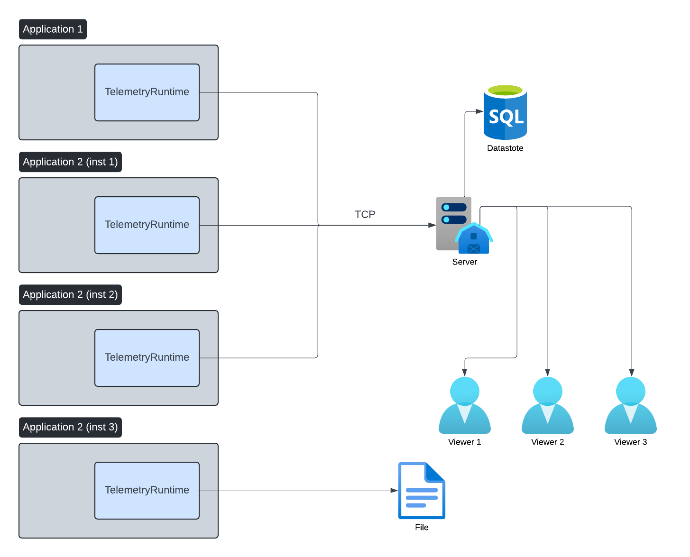
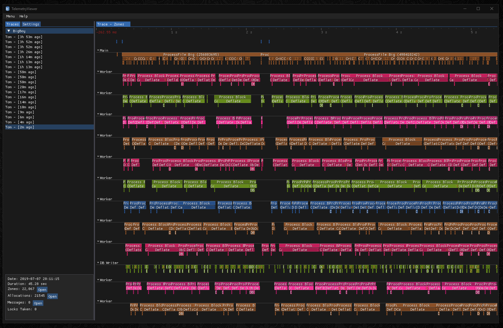
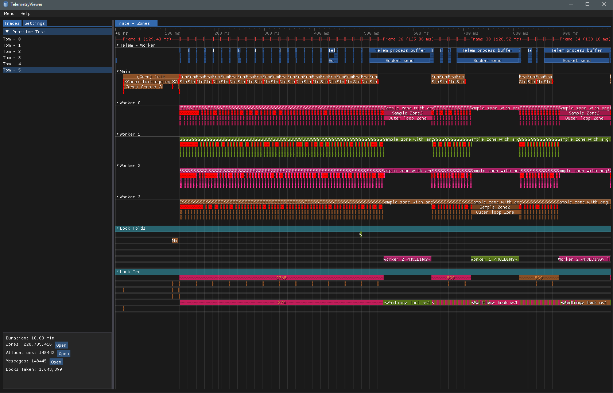

## Synopsis

This is an intrusive performance profiler that is used to profile the engine and some of my other tools.

It has many advantages over your more typical style of profiler like the one included with Visual Studio or Perf.

### Features

- Allow viewing data for every invocation of a traced function
    - The ability to see values of arguments
        - Can highlight arguments that are slower
- Per thread flame graphs which is critical for multithreaded software
- Lock contention
    - Makes it obvious when one thread took much longer than expected because it was waiting on a lock
- Can be started,paused,resumed without application exit
- No analysis stage to wait for, profiling data can be viewed live as it's recorded
- Ability to handle large amounts of tracing data
    - A single run of an application can be profiled for months
    - Can handle 100,000's of events a second
- Stream traces to server over TCP
    - Single server can consume data from multiple sessions
    - Multiple clients can connect and view live or completed traces
    - Data is compressed with LZ4 to minimize bandwidth requirements
    - Automatic debug symbol submission
        - Runtime sends missing pdb files to the server for storage
- Self tracing
    - See how much CPU time is spend tracing
- Event grouping
    - Functions can be grouped to give statistics about each group
- Counters
- Memory stats
- Zero allocations
    - Host application passes a single buffer at start time.

## Architecture

## Screenshots

Trace with 220 million zones over 10 minutes (about 350k events a second).

## Video

Brief demo video showing a sample trace: [https://www.youtube.com/watch?v=4Tp5ttDyFuk](https://www.youtube.com/watch?v=4Tp5ttDyFuk)