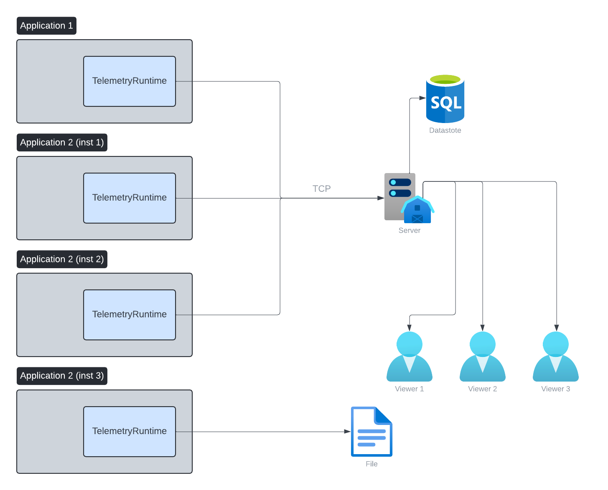

## Synopsis

This is an intrusive performance profiler that is used to profile the engine and some of my other tools.

It has many advantages over your more typical style of profiler like the one included with Visual Studio or Perf.

### Features

- Allow viewing data for every invocation of a traced function
    - The ability to see values of arguments
        - Can highlight arguments that are slower
- Per thread flame graphs which is critical for multithreaded software
- Lock contention
    - Makes it obvious when one thread took much longer than expected because it was waiting on a lock
- Can be started,paused,resumed without application exit
- No analysis stage to wait for, profiling data can be viewed live as it's recorded
- Ability to handle large amounts of tracing data
    - A single run of an application can be profiled for months
    - Can handle 100,000's of events a second
- Stream traces to server over TCP
    - Single server can consume data from multiple sessions
    - Multiple clients can connect and view live or completed traces
    - Data is compressed with LZ4 to minimize bandwidth requirements
    - Automatic debug symbol submission
        - Runtime sends missing pdb files to the server for storage
- Event grouping
    - Functions can be grouped to give statistics about each group
- Counters
- Memory stats
- Low overhead runtime
     - Zero allocations
        - Host application passes a single buffer at start time.
    - Self tracing (See how much CPU time is spent tracing)
    - Collection of data is lock free
        - Single InterlockedExchangeAdd
    - Care is taken to make sure no two threads write collected data to the same cache lane
        - Prevents CPU stalls from false sharing
    - Thread local state for stack tracking


## Architecture



## Screenshots


Trace with 220 million zones over 10 minutes (about 350k events a second).


## Video

Brief demo video showing a sample trace: [https://www.youtube.com/watch?v=4Tp5ttDyFuk](https://www.youtube.com/watch?v=4Tp5ttDyFuk)

## Example

```cpp

telem::ContexHandle ctx;

void foo(int val)
{
    // Zone this function and record the argument
    ttZoneFunction(ctx, "Foo with %d", val);

    while (val > 0) {
        core::Thread::sleep(val);
        val--;
    }
}

core::Thread::ReturnValue threadFunc(const core::Thread& thread)
{
    ttZoneFunction(ctx, "FooBar");

    core::Thread::sleep(rand());

    return core::Thread::ReturnValue(0);
}

int main()
{
    // All Telemetry memory usage will take place in this buffer
    // Size requirements of the buffer depend on a number of factors but 2-4MB is typically enough for most scenarios.
    // Larger buffers are useful if latency is high to the reviving server, as too small a buffer can result in stalls.
    // Since the runtime must wait for the server to acknowledge the data before it can overwrite it.
    const size_t telemBufSize = 1024 * 1024 * 4;
    alignas(64) static uint8_t telemBuf[telemBufSize];

    ttInitializeContext(&ctx, telemBuf, sizeof(telemBuf));

    // Connect to server
    auto res = ttOpen(
        ctx,
        "My app name",
        X_BUILD_STRING " Version: " X_ENGINE_VERSION_STR " Rev: " X_ENGINE_BUILD_REF_STR,
        "127.0.0.1",
        TtConnectionTypeTcp,
        telem::DEFAULT_PORT,
        1000,
        TtConnectionFlagNone
    );

    if (res != TtErrorOk) {
        return 1;
    }

    // Setup some meta info
    ttSetThreadName(ctx, 0, "Main");
    ttSetThreadGroup(ctx, 0, 0);

    ttSetThreadGroupName(ctx, 0, "Main");
    ttSetThreadGroupName(ctx, 1, "Workers");
    ttSetThreadGroupName(ctx, 2, "IO");

    // Pause collection
    ttPause(ctx, true);

    // Example trace of a scope
    {
        ttZone(ctx, "Sleep");

        core::Thread::sleep(16);
    }

    // Resume
    ttPause(ctx, false);

    // Zone some functions
    foo(0);
    foo(1);
    foo(2);
    foo(3);

    // Start some threads
    const int32_t numThreads = 4;
    core::Thread thread[numThreads];

    core::StackString256 name;
    for (int32_t i = 0; i < numThreads; i++) {
        name.setFmt("Worker %" PRIi32, i);

        thread[i].create(name.c_str());
        thread[i].start(threadFunc);

        ttSetThreadName(ctx, thread[i].getID(), "%s", name.c_str());
        ttSetThreadGroup(ctx, thread[i].getID(), 1);
    }

    // join
    for (int32_t i = 0; i < numThreads; i++) {
        thread[i].join();
        thread[i].destroy();
    }

    ttShutdownContext(ctx);
    return 0;
}

```

